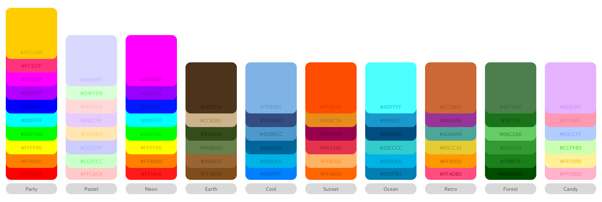

# Sherlock Confetti

Sherlock Confetti is a lightweight program that displays a confetti animation
as a top-level overlay on Wayland compositors. It provides a fun and colorful
visual effect without interfering with your workflow.

<https://github.com/user-attachments/assets/d4e63a6b-ce41-4faa-8a1e-898570056e84>

## Features

- **Wayland-native:** Built specifically for Wayland environments.
- **Tiling Window Manager Friendly:** Displays on top without disrupting your
  window layout.
- **High-performance rendering with WGPU:** Utilizes GPU acceleration for
  smooth animation.
- **Shader-driven confetti:** Custom shaders deliver rich, dynamic visual
  effects.
- **Multiple Color Palettes:** Choose from a variety of predefined vibrant and
  pastel palettes.
- **Standalone or Integrated:** Originally created for the custom launcher
  [Sherlock](https://github.com/Skxxtz/sherlock), but fully functional as a
  standalone program.

## Usage

Simply run the program to enjoy confetti animations on your Wayland session. It
can be integrated or triggered by other applications such as launchers or
window managers.

```bash
confetti
```

## Installation

### Build Dependencies
- 'libxkbcommon'

### Runtime Dependencies
- `vulkan-icd-loader`
- `mesa`
- `wayland`
- `wayland-protocols`

### <ins>From Source</ins>

To build Confetti from source, follow these steps.<br>
Make sure you have the necessary dependencies installed:

- `rust` - [How to install rust](https://www.rust-lang.org/tools/install)
- `git` - [How to install git](https://github.com/git-guides/install-git)

1. **Clone the repository**:

    ```bash
    git clone https://github.com/skxxtz/sherlock-confetti.git
    cd sherlock-confetti
    ```

2. **Build the project**:

    ```bash
    cargo build --release
    ```

3. **Install the binary**:

    After the build completes, install the binary to your system:

    ```bash
    sudo cp target/release/confetti /usr/local/bin/
    ```

### <ins>From Binary</ins>

Make sure you have the following dependency installed:

- `tar` - [Tar](https://www.gnu.org/software/tar/)

1. **Download the archive containing the latest release**:

    The archive can be found [here](https://github.com/Skxxtz/sherlock-confetti/releases/latest).

2. **Extract the files from the archive**:

    ```bash
    cd ~/Downloads/
    tar -xzf sherlock-confetti*.tar.gz
    ```

    You can use tab-completion or run `ls` to verify the name of the archive.

3. **Install the binary**:

    Now move the binary to a location on your `$PATH` environment variable:

    ```bash
    sudo mv confetti /usr/local/bin/
    ```

    Optionally also move the LICENSE file or delete it:

    ```bash
    sudo mkdir -p /usr/share/doc/confetti
    sudo mv LICENSE /usr/share/doc/confetti/

    # or, to remove it:
    rm LICENSE
    ```

### <ins>Build Debian Package</ins>

To build a `.deb` package directly from the source, follow these steps:<br>
Make sure you have the following dependencies installed:

- `rust` - [How to install rust](https://www.rust-lang.org/tools/install)
- `git` - [How to install git](https://github.com/git-guides/install-git)

1. **Install the `cargo-deb` tool**:

    First, you need to install the `cargo-deb` tool, which simplifies packaging Rust projects as Debian packages:

    ```bash
    cargo install cargo-deb
    ```

2. **Build the Debian package**:

    After installing `cargo-deb`, run the following command to build the `.deb` package:

    ```bash
    cargo deb
    ```

    This will create a `.deb` package in the `target/debian` directory.

3. **Install the generated `.deb` package**:

    Once the package is built, you can install it using:

    ```bash
    sudo dpkg -i target/debian/confetti_*.deb
    ```

    You can use tab-completion or `ls target/debian/` to confirm the file name.

    (Make sure to replace the filename if the version number is different.)

## Palettes

Palettes can be selected by running `confetti` with the `--palette <name>`
flag. The names for available palettes are listed in the graphic below:

<div align="center" style="text-align:center; border-radius:10px;">
  <picture>
    
  </picture>
</div>
